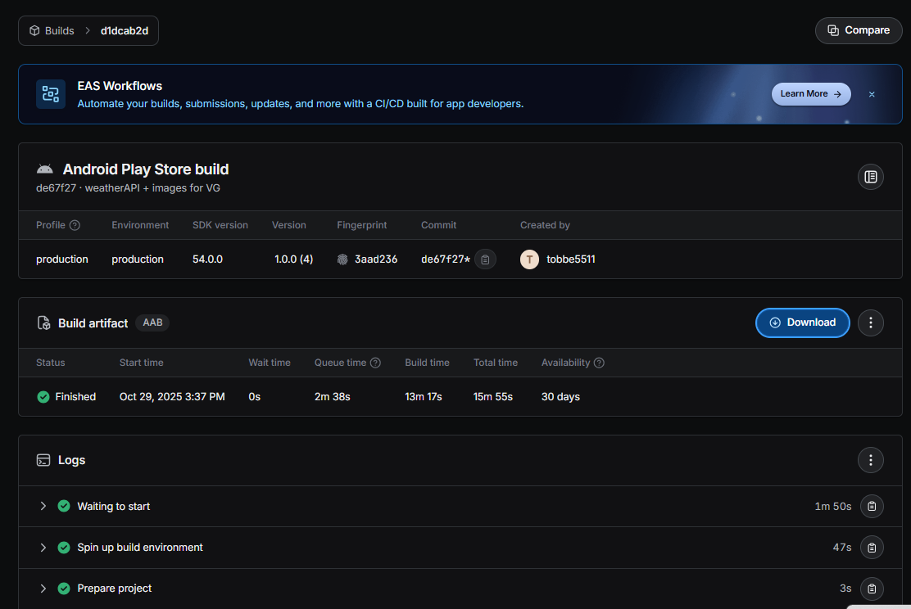

# Inlämningskrav för VG

## Inlämning

Lägg in den här filen i rooten av ditt projektet. Se sedan till att lägg till bilder och andra filer som behövs i projektet också och uppdatera länkarna nedan i det här dokumentet.

När du är klar zippar du ihop projektet (utan node_modules) och lämnar in inlämningen på nytt i Google Classroom.

**OBS: Öppna den här filen som preview så du ser att dina länkar är rätt. Om bilder inte visas så kommer VG kompletteringen inte att godkännas.**

## Förbered appen

Utöver det som ska anges i den här filen så ska du även lägga till en appikon och en splashscreen i [app.json](./app.json) filen samt eventuella andra inställningar om du har använt dig av exempelvis kameran eller GPS'en, den informationen finns dokumenterad för respektive modul i Expo referensen.

**Det här måste göras innan du bygger appen.**

## Skyltfönstret i butiken & Bygga appen.

Nu kan du bygga appen med EAS och ladda hem filen när den är klar. Fyll sedan i nedanstående uppgifter som bevis på att du bara är några få steg ifrån att lansera din applikation på butiken.

**Applikationens Namn:** Plucky

**Kort Beskrivning (max 80):** En app till för att hitta och stödja lokala matproducenter och gårdsbutiker i din närhet.

**Fullständig Beskrivning (max 4000):** Plucky är en mobil applikation som hjälper användare att upptäcka lokala matproducenter, gårdsbutiker och självplockställen i sin närhet. Appen erbjuder funktioner som kartvisning, avståndsmätning baserat på användarens plats, få snabb vägbeskrivning samt inblick i vädret där butiken ligger, samt möjlighet för egna ägare av gårdsbutiker samt självplock att lägga till nya butiker. Målet är att stödja lokal matproduktion och ge användare enkel åtkomst till närproducerad mat. Win win för alla inblandade. 

Applikationens ikon och laddningsbild.
;
;
[Läs mer om dessa bilder här](https://docs.expo.dev/develop/user-interface/splash-screen-and-app-icon/).

En omslagsbild som visas på olika ställen i butiken.
;

Två till åtta fönsterbilder i formatet 16:9 eller 9:16 samt bredd och höjd mellan 320 och 3840 px.
;
;
;

[Binärfilen](/application-d1dcab2d-88d8-46f9-a46c-adaad2b805ae.aab);
;
Tänk på att bilden måste visa både "Created By" och "Start Time".
